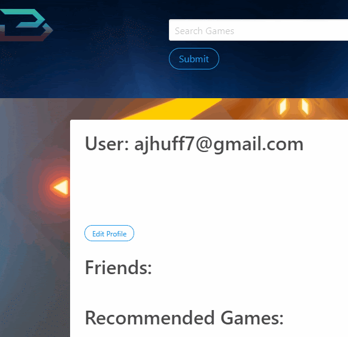
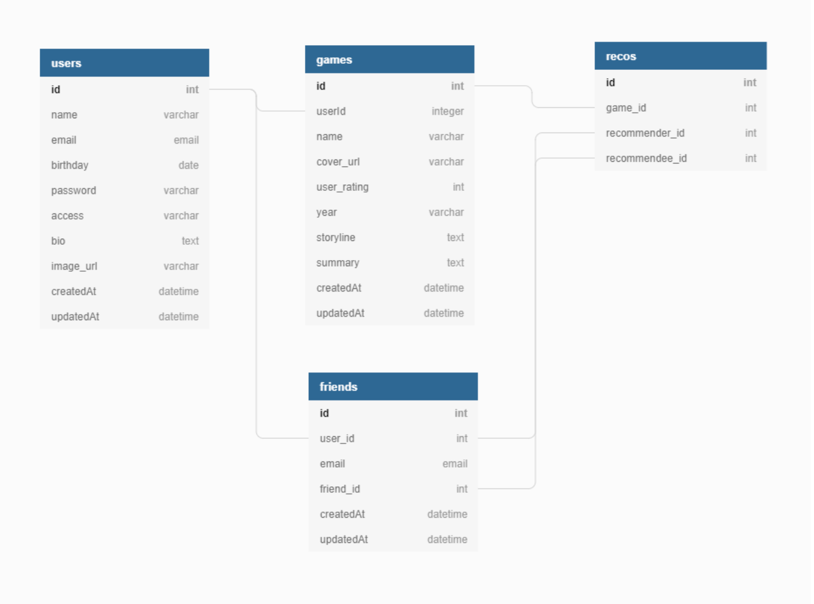

# One Up Database

## Description

1^DB ("One Up DB") is an interactive database where video game fans use sign up and login functionality through passport, and bcrypt to create a profile on our database using mysql and sequelize that lets them search for their favorite video games using axios, express, and the IGDB api and curate a list of their favorites. Users can also add friends through our database and send them recommendations for games and also add a bio and profile picture to their profiles.

## Motivation

We wanted to create an app that let users find their favorite games, learn more about them, and be able to recommend them to their friends.

## User Stories

As a gamer this app lets me find any game i could think of and share it with my friends!

As a parent this app lets me stay up to date with what games my children are playing while on their game consoles.

As a student

## Table of Contents

* [Description](#description)
* [Tech Used](#tech-used)
* [Installation](#installation)
* [Usage](#usage)
* [Features](#features)
* [Deployed_Link](#deployed-link)
* [Authors](#authors)
* [Credits](#credits)
* [License](#license)

## Tech Used

* [HTML](https://developer.mozilla.org/en-US/docs/Web/HTML)
* [Javascript](https://developer.mozilla.org/en-US/docs/Web/JavaScript)
* [CSS](https://developer.mozilla.org/en-US/docs/Web/CSS)
* [jQuery](https://jquery.com/)
* [AJAX](https://developer.mozilla.org/en-US/docs/Web/Guide/AJAX)
* [JSON](https://developer.mozilla.org/en-US/docs/Learn/JavaScript/Objects/JSON)
* [node.js](https://nodejs.org/en/)
* [npm](https://www.npmjs.com/)
* [Sequelize ORM](https://sequelize.org/)
* [MySQL](https://www.mysql.com/)
* [Bulma](https://getbootstrap.com/)
* [Passport](http://www.passportjs.org/)
* [Express](https://expressjs.com/)
* [Bcrypt](https://www.npmjs.com/package/bcryptjs)
* [Axios](https://www.npmjs.com/package/axios)
* [IGDB API](https://www.igdb.com/api)

## Installation

To install run Npm install while navigated to the directory you download this application to. To run the application locally, initialize a MySQL database called vgdb, then run node server.js in your terminal. 

## Usage

Simply create a profile with your name, email, password, and date of birth to start searching for video games, saving to your favorites, and recommending them to your friends!

--

### Searching for a Game

### Sign Up Page

### Members/Profile Page

### Database Layout

---

## Code Snippets

This code is using an express post to add a recommended game from a user to another user who is listed in the database as friends.  

This code uses an express post to call an axios search.

---
## Features

- Search for your favorite video games
- Display information about 250,000+ different games
- Save/delete games to/from your profile
- Add profile description and profile image
- Add Friends
- Recommend games to friends
- Delete recommendations

## Deployed Link

* [See Live Site](https://oneupdb.herokuapp.com/)

---

## Authors

**Jon SanPedro**

- [Portfolio Site](https://github.com/jsp117/Jon-SanPedro-Portfolio)
- [Github](https://github.com/jsp117)
- [LinkedIn](https://www.linkedin.com/in/jonathan-s-6ab32283/)

**AJ Huff** 

- [Portfolio Site](https://ajhuff7.github.io/portfolio-one/)
- [Github](https://github.com/ajhuff7)
- [LinkedIn](https://www.linkedin.com/in/aj-huff-7696b14b/)

**Ry Hull**

- [Portfolio Site](https://ryandelonhull.github.io/Bootstrap-Portfolio/)
- [Github](https://github.com/ryandelonhull)
- [LinkedIn](https://linkedin.com/in/ryan-hull-94003144)

## *Credits/Acknowledgements*

Thank you to Jerome, Roger, Manuel, and Kerwin for having us ready to take on a project like this.

## License

