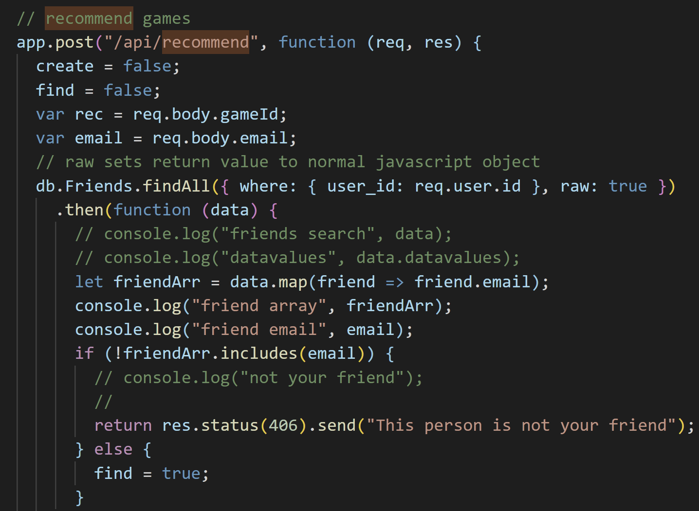
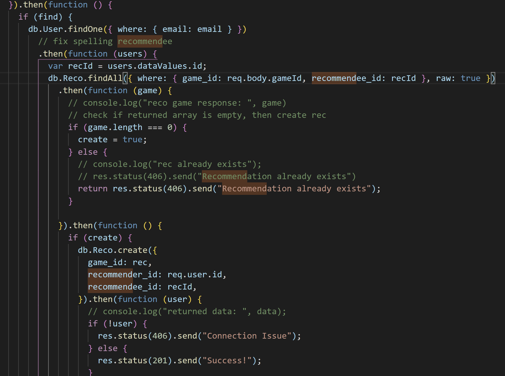
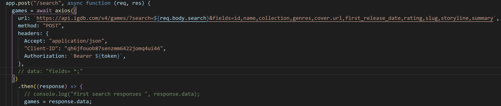

# One Up Database

## Description

OneUpDB is an interactive database where video game fans use sign up and login functionality through passport, and bcrypt to create a profile on our database using mysql and sequelize that lets them search for their favorite video games using axios, express, and the IGDB api and curate a list of their favorites. Users can also add friends through our database and send them recommendations for games and also add a bio and profile picture to their profiles.

## Motivation

We wanted to create an app that let users find their favorite games, learn more about them, and be able to recommend them to their friends.

## Table of Contents

* [Description](#description)
* [Motivation](#motivation)
* [User Story](#user-story)
* [Tech Used](#tech-used)
* [Installation](#installation)
* [Usage](#usage)
* [Guest Account](#guest-account)
* [Features](#features)
* [Deployed_Link](#deployed-link)
* [Authors](#authors)
* [License](#license)

## User Story

As a user I want to...

- Log into my account
- Save all of my favorite games
- Recommend games to my friends
- Be able to search for and view game information

## Tech Used

* [HTML](https://developer.mozilla.org/en-US/docs/Web/HTML)
* [Javascript](https://developer.mozilla.org/en-US/docs/Web/JavaScript)
* [CSS](https://developer.mozilla.org/en-US/docs/Web/CSS)
* [jQuery](https://jquery.com/)
* [AJAX](https://developer.mozilla.org/en-US/docs/Web/Guide/AJAX)
* [JSON](https://developer.mozilla.org/en-US/docs/Learn/JavaScript/Objects/JSON)
* [node.js](https://nodejs.org/en/)
* [npm](https://www.npmjs.com/)
* [Sequelize ORM](https://sequelize.org/)
* [MySQL](https://www.mysql.com/)
* [Bulma](https://getbootstrap.com/)
* [Passport](http://www.passportjs.org/)
* [Express](https://expressjs.com/)
* [Bcrypt](https://www.npmjs.com/package/bcryptjs)
* [Axios](https://www.npmjs.com/package/axios)
* [IGDB API](https://www.igdb.com/api)

## Installation

To install run Npm install while navigated to the directory you download this application to. To run the application locally, initialize a MySQL database called vgdb, then run node server.js in your terminal. 

## Usage

Simply create a profile with your name, email, password, and date of birth to start searching for video games, saving to your favorites, and recommending them to your friends!

---

## Guest Account

We have created a guest account for those that wish to use our application but not create their own account. 

Login: guest@guest.com

Password: password

---

## Code Snippets

This code snippet displays the backend code to recommend games. Using the /api/recommend route called from the front end using a post method, it checks the database to see if the user you are trying to recommend to is already your friend, then checks the recommendations table to see if the recommendation already exists, then inserts the game id, recommender id and recommendee id into the recommendation table.  

This code snippet displays the code required to get an access token for IGDB. It requires a registered client ID and client secret, and the token it gives expires after a set amount of time. Each time a user logs in, this code is run to get a unique access token and store it in the user table.

This code snippet displays the backend code that queries the IGDB database with the user input sent from the frontend. It requires an access token and a registered client ID. After the database is queried, the search html page is loaded and the results displayed.

This gif displays our api-routes file.

---

## Features

- Search for your favorite video games
- Display information about 250,000+ different games
- Save/delete games to/from your profile
- Add profile description and profile image
- Add Friends
- Recommend games to friends
- Delete recommendations

## Deployed Link

* [See Live Site](https://oneupdb.herokuapp.com/)

---

## Authors

**Jon SanPedro**

- [Portfolio Site](https://github.com/jsp117/Jon-SanPedro-Portfolio)
- [Github](https://github.com/jsp117)
- [LinkedIn](https://www.linkedin.com/in/jonathan-s-6ab32283/)

**AJ Huff** 

- [Portfolio Site](https://ajhuff7.github.io/portfolio-one/)
- [Github](https://github.com/ajhuff7)
- [LinkedIn](https://www.linkedin.com/in/aj-huff-7696b14b/)

**Ry Hull**

- [Portfolio Site](https://ryandelonhull.github.io/Bootstrap-Portfolio/)
- [Github](https://github.com/ryandelonhull)
- [LinkedIn](https://linkedin.com/in/ryan-hull-94003144)

## *Credits/Acknowledgements*

Thank you to Jerome, Roger, Manuel, and Kerwin for having us ready to take on a project like this.

## License

