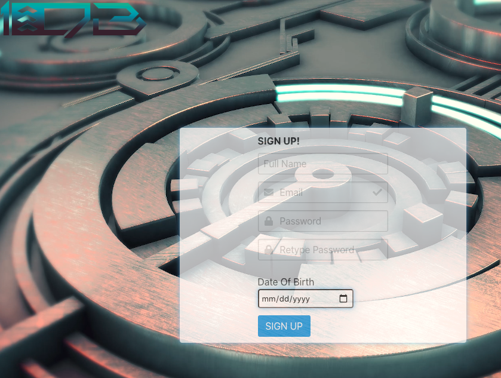

1^DB ("One Up DB") is an interactive database where video game fans use sign up and login functionality through passport, passport-local, and bcrypt to create a profile on our database using mysql and sequelize that lets them search for their favorite video games using axios, express, and the IGDB api and curate a list of their favorites. Users can then send recommendations of games to other users on the app as well!
## Motivation
We wanted to create an app that let users find their favorite games and be able to recommend them to their friends.
## Table of Contents
* [Tech Used](#tech-used)
* [Installation](#installation)
* [Usage](#usage)
* [Features](#features)
* [Deployed_Link](#deployed-link)
* [Authors](#authors)
* [Credits](#credits)
* [License](#license)
----
## Tech Used
* [HTML](https://developer.mozilla.org/en-US/docs/Web/HTML)
* [Javascript](https://developer.mozilla.org/en-US/docs/Web/JavaScript)
* [CSS](https://developer.mozilla.org/en-US/docs/Web/CSS)
* [jQuery](https://jquery.com/)
* [AJAX](https://developer.mozilla.org/en-US/docs/Web/Guide/AJAX)
* [JSON](https://developer.mozilla.org/en-US/docs/Learn/JavaScript/Objects/JSON)
* [node.js](https://nodejs.org/en/)
* [npm](https://www.npmjs.com/)
* [Sequelize ORM](https://sequelize.org/)
* [MySQL](https://www.mysql.com/)
* [Bulma](https://getbootstrap.com/)
* [Passport](http://www.passportjs.org/)
* [Express](https://expressjs.com/)
* [Bcrypt](https://www.npmjs.com/package/bcryptjs)
* [Axios](https://www.npmjs.com/package/axios)
* [IGDB API](https://www.igdb.com/api)
## Installation
To install run Npm install and access with node server.js.
## Usage
Simply create a profile with your name, email, password, and date of birth to start searching for video games, saving to your favorites, and recommending them to your friends!

## Features
- 
- 
- 
- 
- 
- 
## Deployed Link
* [See Live Site](https://one-up-db.herokuapp.com/)
---
## Authors
**Jon SanPedro**
- [Portfolio Site](https://github.com/jsp117/Jon-SanPedro-Portfolio)
- [Github](https://github.com/jsp117)
- [LinkedIn](https://www.linkedin.com/in/jonathan-s-6ab32283/)
**AJ Huff** 
- [Portfolio Site](https://ajhuff7.github.io/portfolio-one/)
- [Github](https://github.com/ajhuff7)
- [LinkedIn](https://www.linkedin.com/in/aj-huff-7696b14b/)
**Ry Hull**
- [Portfolio Site](https://ryandelonhull.github.io/Bootstrap-Portfolio/)
- [Github](https://github.com/ryandelonhull)
- [LinkedIn](https://linkedin.com/in/ryan-hull-94003144)
## Credits
## License
